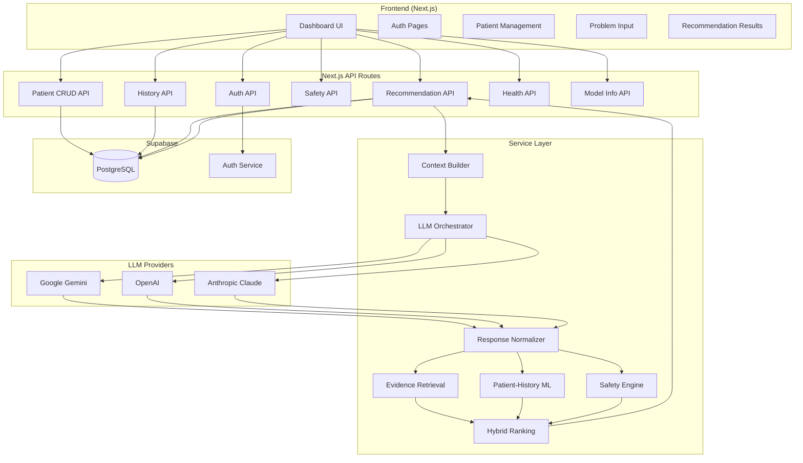
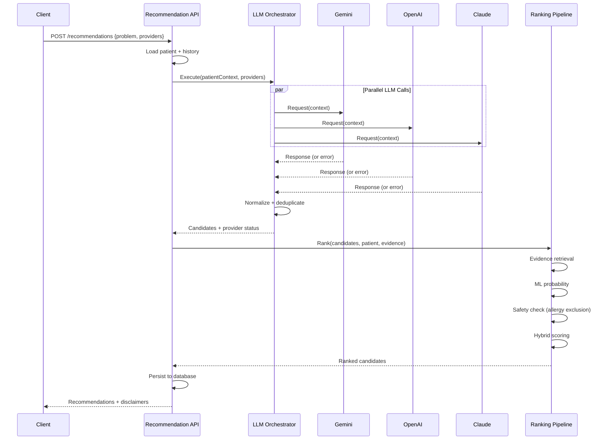
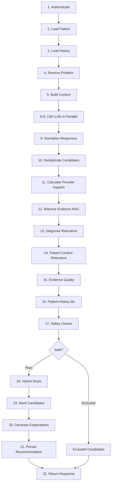
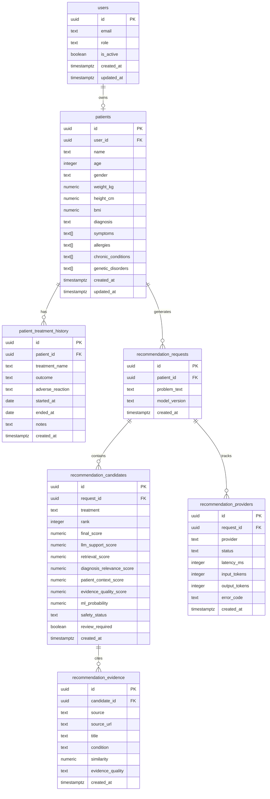
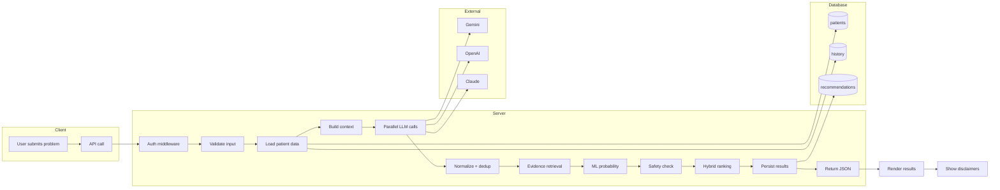

# System Architecture

## Overview

The Personalized Treatment Recommendation System is a clinical decision-support application that combines patient history with multi-LLM analysis to produce candidate treatment options. It is explicitly **educational/research** — it does not diagnose, prescribe, or replace a qualified clinician.

## Technology Stack

| Layer | Technology |
|-------|-----------|
| Frontend | Next.js 13 (App Router), React 18, TypeScript, Tailwind CSS, shadcn/ui |
| API | Next.js Server Routes (TypeScript) |
| Database | Supabase (PostgreSQL) with Row-Level Security |
| Auth | Supabase Auth (email/password) with JWT sessions |
| LLM Providers | Google Gemini, OpenAI, Anthropic Claude |
| Retrieval | TF-IDF + semantic embeddings (client-side computation) |
| ML | Patient-history logistic regression classifier (client-side) |

## Architecture Diagram

## LLM Orchestration Diagram

## Recommendation Pipeline Diagram

## Database Relationship Diagram

## Request Lifecycle

## Key Design Principles

1. **Safety overrides ranking** — allergy exclusions are hard constraints, never weighted
2. **Honesty about uncertainty** — missing information is `unknown` or `review_required`, never "safe"
3. **Provider transparency** — failures are shown to the user, never hidden or fabricated
4. **Parallel execution** — all enabled LLM providers are queried concurrently
5. **Explainability** — every recommendation includes a reason and score breakdown
6. **No fabrication** — the system never invents evidence, dosages, or safety information
